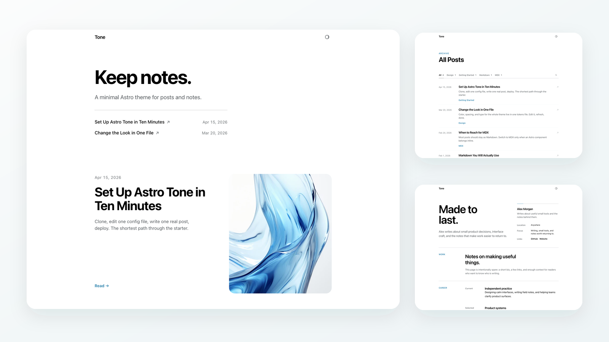
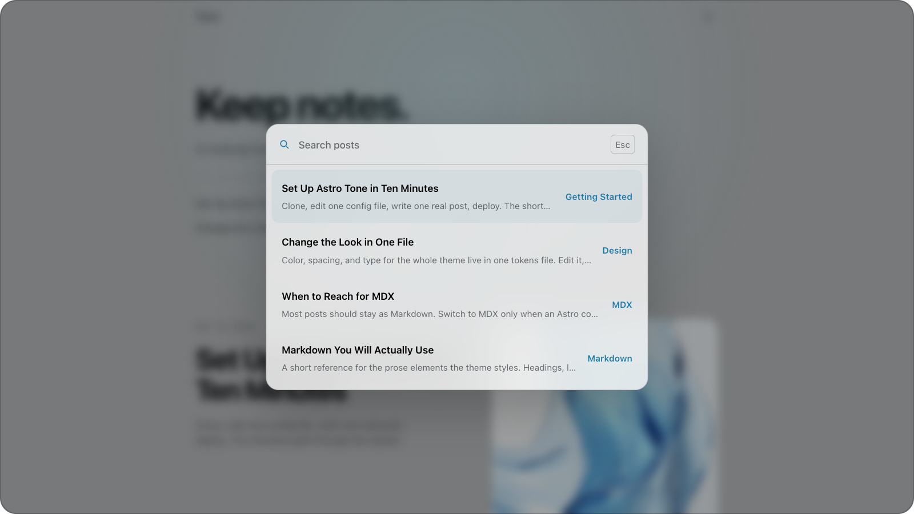
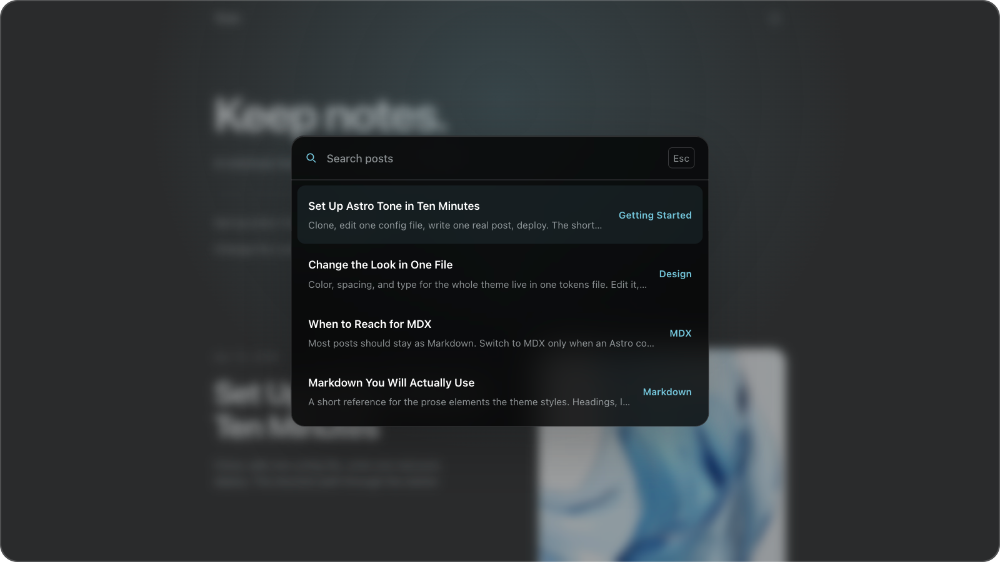

# Tone

Typography-first Astro blog starter with quiet defaults, MDX support, dark mode,
Pagefind search, RSS, sitemap output, and a minimal writing surface.

<p>
  <a href="https://hanityx.github.io/astro-tone/">Live demo</a> ·
  <a href="https://github.com/hanityx/astro-tone">Use this template</a>
</p>



## Command Palette

Open quick post search with `Cmd`/`Ctrl` + `K`.

<p>
  
  
</p>

## Features

- Astro 6 static site
- Markdown and MDX posts in `src/content/blog`
- Blog index with category filters and inline list search
- `/search` route powered by Pagefind
- `Cmd`/`Ctrl` + `K` command palette for quick post search
- Dark mode with CSS tokens
- Custom code block theme via Expressive Code
- Related posts, RSS, sitemap, Open Graph metadata, and JSON-LD
- Optional giscus comments, disabled by default
- Optional `focusEffect: 'scroll-dark'` for long-form posts

<details>
<summary>Performance Snapshot</summary>

Measured with Lighthouse 12.8.2 against a local production preview on May 20, 2026. Treat these as a reproducible baseline, not a permanent hosted score.

| Surface | Mode    | Performance | Accessibility | Best Practices | SEO | FCP    | LCP    | CLS | TBT  |
| ------- | ------- | ----------- | ------------- | -------------- | --- | ------ | ------ | --- | ---- |
| Home    | Mobile  | 100         | 100           | 100            | 100 | 830 ms | 981 ms | 0   | 0 ms |
| Home    | Desktop | 100         | 100           | 100            | 100 | 228 ms | 249 ms | 0   | 0 ms |
| Post    | Mobile  | 100         | 100           | 100            | 100 | 1.21 s | 1.36 s | 0   | 0 ms |
| Post    | Desktop | 100         | 100           | 100            | 100 | 349 ms | 372 ms | 0   | 0 ms |

Additional local measurements:

- Home transfer size: 145 KiB mobile, 152 KiB desktop
- Post transfer size: 44 KiB mobile, 48 KiB desktop
- Cumulative Layout Shift: `0` on all measured pages
- Total Blocking Time: `0 ms` on all measured pages
- Static output: 9 pages in the current sample set
- Pagefind index: 4 pages, 828 words

Reproduce locally:

```bash
npm run build
npm run preview -- --host 127.0.0.1 --port 4321
npx lighthouse http://127.0.0.1:4321/ --output=json
npx lighthouse http://127.0.0.1:4321/ --preset=desktop --output=json
```

</details>

## Quick Start

Requires Node.js 22.12.0 or newer.

Use the template:

```bash
npm create astro@latest astro-tone -- --template hanityx/astro-tone
cd astro-tone
npm run dev
```

Or clone it directly:

```bash
git clone https://github.com/hanityx/astro-tone.git
cd astro-tone
npm install
npm run dev
```

The local dev server usually starts at `http://localhost:4321`.

## Commands

| Command            | Action                                         |
| ------------------ | ---------------------------------------------- |
| `npm run dev`      | Start the local dev server                     |
| `npm run build`    | Build the site and generate the Pagefind index |
| `npm run preview`  | Preview the production build                   |
| `npm run check`    | Run Astro type checks                          |
| `npm run lint`     | Run ESLint                                     |
| `npm run lint:css` | Run Stylelint                                  |
| `npm run format`   | Format source files with Prettier              |

## Customize

Most site-level settings live in `astro-theme-config.ts`.

The bundled [setup post](src/content/blog/getting-started-v2.md) walks through
configuration, the project structure, writing posts, replacing the samples,
deployment, and optional giscus comments.

## Deploy

Tone builds as a static site.

| Setting          | Value           |
| ---------------- | --------------- |
| Build command    | `npm run build` |
| Output directory | `dist`          |

The starter supports domain-root deploys and GitHub Pages project paths.

No analytics run by default. To opt into Vercel Analytics, set
`PUBLIC_VERCEL_ANALYTICS=true`.

## License

Tone source code is MIT licensed. Bundled sample images and project marks are
documented in `LICENSE`.
